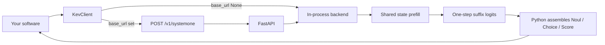

# Kev

Local System One decision engine. Inspiration: TypeSafe Jev. Not a chatbot.

```
unstructured state in → typed probabilistic decisions out
```

Python assembles every response from next-token logits. The model never writes the answer.

```bash
pip install -e ".[dev]"
make demo          # kev demo --model mock, offline
make test
```

```python
from kev import KevClient, Noul, Choice, Score

client = KevClient(model="mock")  # or "kev-latest" on Apple silicon once weights are local

state = {"ticket": "I was charged twice. Please help ASAP.", "plan": "pro"}
questions = {
    "billing": Noul(instructions="Is this about billing?"),
    "tone": Choice(
        instructions="What is the customer's tone?",
        criteria={"calm": None, "frustrated": None, "angry": None},
    ),
    "urgency": Score(
        instructions="How urgent is this?",
        criteria=["can wait", "this week", "today"],
    ),
}
res = client.system_one(state, questions)
print(res.nouls["billing"].noul)
print(res.choices["tone"].choice, res.choices["tone"].confidence)
print(res.scores["urgency"].score, res.scores["urgency"].level)
```

See [DESIGN.md](DESIGN.md) for why we score option tokens instead of generating JSON.

## Why Kev exists

Software already has System Two: rules, routers, queues, humans. What it lacks is a cheap, typed judgment over messy state — “is this billing?”, “which tone?”, “how urgent?” — that **cannot invent a label** and **does not start a chat**.

Calling `generate()` and parsing JSON fails that job. The model writes prose, invents keys, burns a decode per question, and leaves control flow in the prompt. Kev exists so application code can ask closed questions, get distributions, and threshold them. Invalid labels are impossible because only the supplied options exist.

## What is the same as Jev / what is not

**Same idea (reimplemented, not copied):**

- Unstructured state plus developer-supplied questions → typed probabilistic answers.
- Three primitives: Noul, Choice, Score. No free-text answers.
- The model does not write the payload. Logits / heads in, Python out.
- Invalid labels are impossible. Confidence is a number software can threshold.
- Code owns control flow. Kev only judges.

**Not the same:**

- Not TypeSafe, not Jev weights, not their source, API, or runtime. MIT reimplementation of the idea.
- Default local student is Qwen2.5-Instruct 4-bit on Apple silicon (`kev-latest` → 1.5B MLX), not a hosted frontier judge.
- Offline `mock` backend for tests and `kev demo --model mock`.
- Training / distill / eval harnesses in this repo are Kev’s, not Jev’s.
- HTTP and CLI shapes (`POST /v1/systemone`, `kev ask`) are ours.

## SAFETY

**Kev can be confidently wrong.** A high `confidence` or a Noul near `1.0` is not a proof. Mock hashes are not beliefs. A 1.5B student is not a frontier judge. Uncalibrated logits are not probabilities you can treat as frequencies.

**Thresholds live in application code.** Kev returns distributions. Your software decides `noul > 0.8` routes to billing, `confidence < 0.4` pages a human, or a rule short-circuits Kev entirely. Do not ship Kev as the sole authority for money, safety, or access control.

## Architecture



Many questions share one state encode. Adding a question does not start a `generate()` loop. `output_tokens` is always `0`.

On Darwin, `KevClient(model="kev-latest")` loads the MLX backend (`mlx-community/Qwen2.5-1.5B-Instruct-4bit`). `qwen2.5-3b` is the 3B 4-bit MLX repo. Mock stays available everywhere (`--model mock`). Hugging Face Qwen remains for `qwen2.5-7b` / `qwen3-8b` and for slash `Qwen/…` repo ids.

| Type | Ask | Get back |
| --- | --- | --- |
| **Noul** | Is this true? | `noul` in `[0, 1]` — that value *is* P(true) |
| **Choice** | Which option? | `choice`, `probabilities`, `confidence` |
| **Score** | Which level? | `score` as E[level index] in `[0, n-1]`, `level`, `probabilities`, `confidence` |

Choice / Score confidence is `1 - H(p) / log(K)`, clamped to `[0, 1]`. Unknown question types, empty instructions, duplicate ids, and one-option Choice/Score raise `ValueError` (HTTP 422, CLI exit 1). They do not get coerced into chat.

## Console

`GET /` is the System One console (HTML from `src/kev/static/index.html`). The page fetches **root-relative** `/v1/systemone`, `/v1/meta`, and `/v1/decks` — it never hardcodes localhost, so it works behind a reverse proxy at the site root (including RunPod `https://POD-8000.proxy.runpod.net/`).

```bash
kev serve --model mock --host 0.0.0.0 --port 8000
# GET /           console
# GET /healthz    {"status":"ok"}
# GET /v1/meta    bound model
# POST /v1/systemone
```

Default bind is `0.0.0.0`. Override with `--host` / `--port`. Presets: charged twice ASAP, checkout 500, jailbreak. Judge is logits → typed noul/choice/score, not a chat box.

## API

`KevClient(model="mock")` is in-process. `KevClient(base_url="http://127.0.0.1:8787")` POSTs the same body and does not load torch.

`POST /v1/systemone`

```json
{
  "model": "kev-latest",
  "state": {"ticket": "charged twice ASAP"},
  "questions": {
    "billing": {"type": "noul", "instructions": "Is this about billing?"},
    "tone": {
      "type": "choice",
      "instructions": "Tone?",
      "criteria": {"calm": null, "frustrated": null, "angry": null}
    },
    "urgency": {
      "type": "score",
      "instructions": "Urgency?",
      "criteria": ["can wait", "this week", "today"]
    }
  }
}
```

```json
{
  "id": "kev_…",
  "model": "qwen2.5-1.5b",
  "answers": {
    "billing": {"type": "noul", "noul": 0.86},
    "tone": {"type": "choice", "choice": "angry", "probabilities": {}, "confidence": 0.61},
    "urgency": {"type": "score", "score": 1.74, "level": "today", "probabilities": {}, "confidence": 0.55}
  },
  "usage": {"input_tokens": 412, "output_tokens": 0, "latency_ms": 180}
}
```

Also: `GET /healthz`, `GET /v1/models`. The server is bound to `--model` at startup. On a Mac, `kev-latest` resolves to `mlx-community/Qwen2.5-1.5B-Instruct-4bit` (`qwen2.5-1.5b` on the wire). Use `--model mock` when you do not want weights.

```bash
pip install mlx mlx-lm          # Apple silicon
python scripts/download_model.py
# default repo: mlx-community/Qwen2.5-1.5B-Instruct-4bit

make serve          # mock on :8787
kev ask --model qwen2.5-1.5b --state "I was charged twice. Help ASAP." \
  --noul billing="Is this about billing?" \
  --choice tone="calm,frustrated,angry" \
  --score urgency="can wait|this week|today"
kev ask --model mock --state "I was charged twice ASAP" \
  --noul billing="Is this about billing?" \
  --choice tone="calm,frustrated,angry" \
  --score urgency="can wait|this week|today"
```

Examples: `examples/triage_ticket.py`, `examples/batch_docs.py`, `examples/doom_toy.py`.

## Training

Not chat SFT. Each JSONL row is **one atomic decision**. Loss is option-token cross-entropy at the last prompt position (Noul over `{YES,NO}`; Choice/Score over the supplied labels). The student is never trained to emit JSON.

```bash
python scripts/make_toy_dataset.py
# ~200 rule-labeled tickets → data/sft/toy.jsonl and data/eval/toy.jsonl

python scripts/train_sft.py
# MLX LoRA on Qwen2.5-1.5B-Instruct-4bit. Option-token CE only.
# defaults: batch 1, grad accum 4, max seq 1024, rank 8, alpha 16, lr 1e-5, 200 iters
# writes artifacts/kev-1p5-lora/{adapters.safetensors,adapter_config.json}
# Missing mlx: validates the dataset, collates one batch, exits 0.

python scripts/train_sft_hf.py
# PEFT LoRA + bitsandbytes 4-bit CUDA. Default Qwen/Qwen2.5-7B-Instruct.
# Random JSONL row each step. Full-sequence CE. save_pretrained(--out).
# No MLX. Missing CUDA: validates the dataset, exits 0.

python scripts/train_calibrate.py
# fits T on eval split option logits; writes artifacts/kev-1p5-lora/temperature.json

python scripts/eval_kev.py --model mock --data data/eval/smoke.jsonl
python scripts/eval_kev.py --model qwen2.5-1.5b --adapter artifacts/kev-1p5-lora \
  --data data/eval/toy.jsonl
```

```python
client = KevClient(model="kev-latest", adapter="artifacts/kev-1p5-lora")
```

Darwin training is MLX LoRA (not PEFT/CUDA). Loss is option-token CE at the last prompt position (Noul over `{YES,NO}`; Choice/Score over the supplied labels). The student is never trained to emit JSON. `--adapter artifacts/kev-1p5-lora` loads the adapter; `temperature.json` beside it is applied if present.

Teacher distillation (teacher may emit JSON; Kev still does not generate text):

```bash
python scripts/distill_teacher.py \
  --base-url https://api.openai.com/v1 \
  --api-key-env OPENAI_API_KEY \
  --model gpt-4o-mini \
  --in data/raw/tickets.jsonl \
  --questions examples/triage_questions.yaml \
  --out data/sft/teacher.jsonl \
  --max-rows 100
```

No API key: dry-run writes 3 fake rows and discards `rationale_internal`.

Eval harness (`data/eval/smoke.jsonl` is 12 hand-written cases):

```bash
kev eval --cases data/eval/smoke.jsonl --model mock
```

Writes `artifacts/eval/<timestamp>.json` (gold agreement, latency histogram, calibration buckets).

## Limits

- **Uncalibrated until `train_calibrate`.** Raw softmax is not a frequency. Fit `temperature.json` next to the adapter before you threshold Noul as a probability.
- **1.5B is weak.** `kev-latest` is a small local student. It will miss nuance that a frontier teacher would catch. Distill, then train; do not expect 1.5B to be Jev-class out of the box.
- **First-token collisions.** Options that share a tokenizer first id (`yes` / `yesterday`) fall back to teacher-forcing the full string. Still not `generate()`. Prefer option labels with distinct first tokens when you can.
- **Not frontier.** Kev is a local System One layer, not a general reasoner, not an agent, not a substitute for deterministic rules. Run cheap rules first.

## CLI / Makefile

```bash
make test
make lint
make demo           # kev demo --model mock
kev serve --model kev-latest --port 8787
python scripts/download_model.py
python scripts/download_model.py --repo mlx-community/Qwen2.5-3B-Instruct-4bit
```

## License

MIT. Reimplementation of the System One idea. Not affiliated with TypeSafe. Do not copy TypeSafe source.
